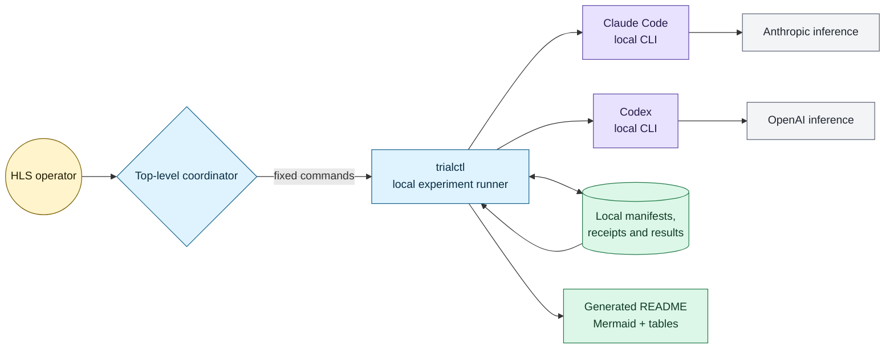
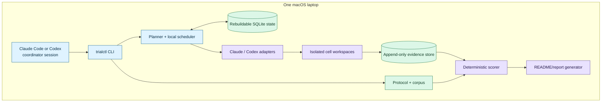
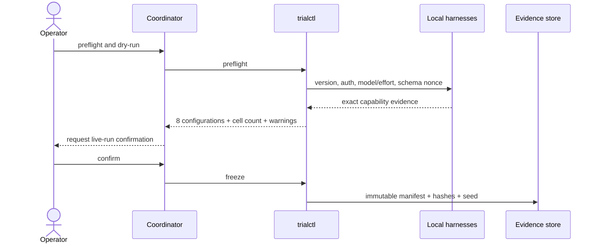
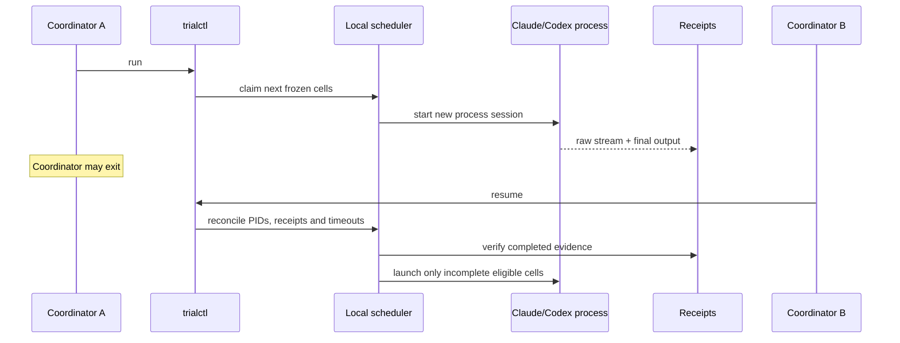
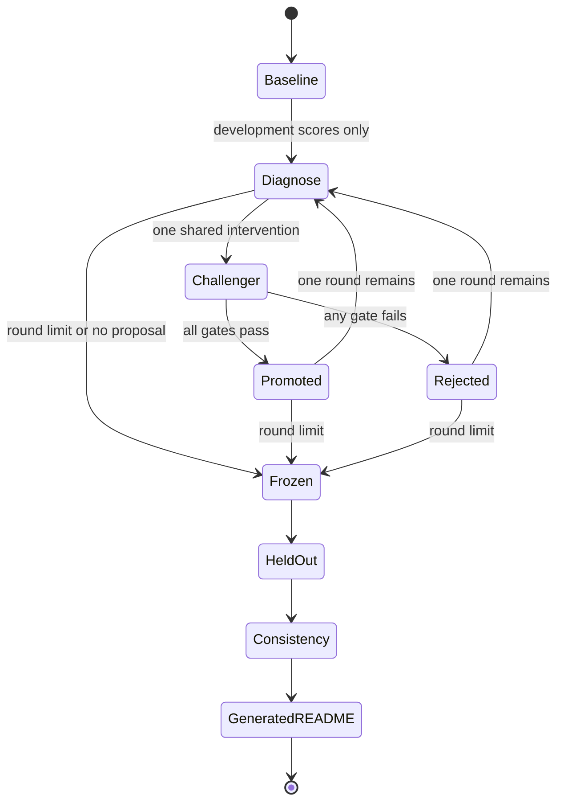

# Architecture: Laptop-Native Structured Reporting Agent Harness Trial

The system is a local, resumable experiment runner controlled by whichever
installed agent harness the operator is currently using. Claude Code or Codex
provides top-level diagnosis and iteration; a small Python CLI owns all
deterministic operations. It invokes only the installed Claude Code and Codex
executables, stores immutable evidence on disk, uses SQLite only as a rebuildable
job index, and generates the public README directly from verified results.

## Context & Constraints

The [confirmed requirements](../requirements/structured-reporting-laptop-agent-harness-trial.md)
require a complete one-sprint build and trial on one macOS laptop. The design
must survive coordinator exits, compare two models and two effort levels in
each of two families, support bounded provider-neutral improvement, expose
actual results through Mermaid and tables, preserve secrets, and remain clearly
separate from a real-company or regulator-facing study.

Architecture priorities, in order:

1. exact reproducibility of planning, scoring, and reporting;
2. honest capture of non-deterministic model execution;
3. low operational burden on one laptop and one operator;
4. coordinator neutrality between Claude Code and Codex;
5. interruption recovery and auditability; and
6. smallest implementation that can execute the whole trial in one sprint.

## System Overview

The coordinator is not a service and owns no durable state. It may be an
interactive Claude Code session, an interactive Codex session, or a documented
non-interactive invocation. Every meaningful operation crosses `trialctl`, so
changing coordinators cannot change cell identities or experiment semantics.

## Containers & Responsibilities

| Container | Responsibility | Technology |
|---|---|---|
| Coordinator session | Diagnose development failures and propose one shared intervention | Installed Claude Code or Codex |
| `trialctl` | Stable command surface and experiment state machine | Python 3.12 CLI (§T2) |
| Protocol/corpus | Frozen matrix, prompts, tasks, synthetic packs, gold definitions | Versioned YAML/JSON and generated artifacts |
| Scheduler | Deterministic expansion/order, detached launch, cooling, reconciliation | Python subprocesses and SQLite (§T3–T4) |
| Harness adapters | Build explicit CLI commands and normalise events/results | Two typed adapters (§T5) |
| Cell workspace | Expose one task/representation under a read-only policy | Temporary local directory |
| Evidence store | Preserve raw streams, receipts, scores, and decisions | Content-addressed files (§T3) |
| Scorer/report | Deterministic metrics and generated README/Mermaid | Python, JSON Schema, templates (§T6) |

## Critical Flows

### Preflight and freeze

### Detached execution and resume

### Bounded improvement

## Decision Criteria

| Criterion | Constraint / weight | Chosen architecture | Evidence |
|---|---|---|---|
| Laptop-only | MUST | One foreground CLI plus detached local children | No server or deployment unit |
| Coordinator-neutral | MUST | All state transitions are CLI commands | Same manifest/report under either harness |
| Recoverable | MUST | Process groups, receipts, and rebuildable index | Kill/resume acceptance test |
| Fair and auditable | MUST | Frozen commands and immutable receipts | Exact executable/model/effort per cell |
| One sprint | High | Two adapters and one runtime | No SDK, dashboard, queue, or cloud layer |
| Publicly inspectable | High | Files and generated Markdown/Mermaid | No proprietary datastore or UI |

## Tech Choices

### T1: Coordination boundary

| Option | Pros | Cons |
|---|---|---|
| Agent conversation owns scheduling | Very little code | State is fragile; coordinator changes alter behaviour |
| Agent drives deterministic local runner | Agentic diagnosis plus repeatable mechanics | Requires a small runner |
| Local web/service control plane | Rich monitoring and concurrency | Operationally unnecessary; violates simplicity goal |

**Chosen:** agent drives a deterministic local runner. The coordinator decides
what to try; `trialctl` decides exactly what runs and what counts. This is the
smallest boundary that makes interruption recovery and coordinator parity real.

**Revisit when:** a required operation cannot be represented as an idempotent
CLI command or more than one host must participate.

### T2: Runner runtime

| Option | Pros | Cons |
|---|---|---|
| Python 3.12 | Strong document/data libraries; standard SQLite/subprocess support | Requires Python environment |
| TypeScript/Node | Familiar CLI ecosystem and strong schemas | Weaker fit for XBRL/PDF analysis |
| Shell scripts | Minimal bootstrap | Poor typed contracts, testing, and recovery logic |

**Chosen:** Python 3.12 with `uv`, typed models, JSON Schema, and pytest. It fits
the document/scoring work and implements process/session control without another
runtime or service.

**Revisit when:** target-host Python bootstrap proves materially less reliable
than the already-installed Node runtime during the implementation spike.

### T3: Evidence and state

| Option | Pros | Cons |
|---|---|---|
| SQLite as sole store | Atomic and queryable | Opaque diffs; harder independent audit |
| Append-only files only | Transparent and portable | Concurrent claims/recovery are awkward |
| Append-only evidence plus rebuildable SQLite index | Transparent evidence and atomic local scheduling | Two representations must be reconciled |

**Chosen:** immutable/content-addressed files are authoritative; SQLite is a
disposable scheduler index rebuilt and verified from receipts. This prevents a
corrupt database from becoming a lost experiment.

**Revisit when:** receipt count or concurrent writers make rebuild exceed 30
seconds or SQLite locking delays dispatch by more than one minute.

### T4: Process durability and isolation

| Option | Pros | Cons |
|---|---|---|
| Harness background-agent features | Easy launch | Different semantics and lifecycle per harness |
| Detached OS subprocess per cell | Uniform, inspectable, no service | Runner must reconcile PIDs and orphans |
| Container per cell | Strong isolation | Extra platform and setup cost |

**Chosen:** one temporary workspace and new OS process session per cell, with
read-only inputs and an explicit tool policy. Containers are unnecessary for
fictional, non-executable inputs. The scheduler starts no more than two cells
overall and one per provider.

**Revisit when:** a harness cannot enforce the read-only/no-network policy, or
untrusted/executable report content enters scope.

### T5: Inference integration

| Option | Pros | Cons |
|---|---|---|
| Provider SDKs | Precise API parameters | Does not test installed agent harnesses; adds auth paths |
| Installed CLI adapters | Matches the trial question and subscriptions | Event formats differ and can drift |
| Common proxy around both providers | Uniform wire protocol | New service and possible behavioural distortion |

**Chosen:** two thin adapters invoke absolute installed Claude Code and Codex
paths with explicit model, effort, schema, permissions, and no-fallback flags.
Adapters normalise evidence after execution but do not conceal native failures.

**Revisit when:** a CLI cannot expose its exact model/effort, structured final
response, or sufficient usage metadata during preflight.

### T6: Scoring and reporting

| Option | Pros | Cons |
|---|---|---|
| Manual analysis and README editing | Flexible | Not reproducible; invites selective reporting |
| LLM judge and generated prose | Handles ambiguity | Circular and non-deterministic |
| Deterministic scorer and generated README | Auditable and drift-detectable | Task/gold authoring takes care |

**Chosen:** deterministic component scoring and a template-generated README,
including generated Mermaid and matching accessible tables. The coordinator may
write a structured intervention hypothesis but cannot hand-edit results.

**Revisit when:** a required task cannot be scored by exact/tolerance,
controlled propositions, and evidence locators without a separately validated
human or model-judge protocol.

## Data

Tracked protocol data contains canonical fictional reports, deterministic
XBRL/iXBRL/HTML/PDF generators, task definitions, schemas, gold answers, and
portable harness profiles. Frozen run data contains the expanded manifest and
hashes. Runtime data contains raw streams, receipts, derived scores, intervention
decisions, and report inputs. Secrets and absolute paths live only in
`.trial/host.local.toml`, which is gitignored and owner-readable.

The invariant is one-way derivation:

`canonical sources → representations → frozen cases → raw receipts → scores → results → README`.

No downstream artifact may modify or replace an upstream artifact.

## Deployment & Scaling Posture

There is no deployment. A clean clone uses `uv sync`, creates a local host
profile, runs offline tests, and then executes preflight. The operator launches
and monitors the run from an installed Claude Code or Codex session. Results are
ordinary repository files reviewed locally before any separately approved push
or publication.

The v1 concurrency limit is two cells overall and one per provider. Reopen the
architecture before adding a second host, remote queue, daemon, or web UI. A
remote execution seam is deliberately not built speculatively.

## Epics

| Epic | One-line responsibility | Design doc |
|---|---|---|
| Protocol and corpus | Generate equivalent fictional packs and freeze fair tasks/matrix/scoring | [Experiment protocol](../design/structured-reporting-experiment-protocol.md) |
| Laptop runner and adapters | Preflight, dispatch, isolate, resume, and preserve evidence through two local CLIs | [Laptop runner](../design/structured-reporting-laptop-runner.md) |
| Improvement and analysis | Diagnose development failures and mechanically promote/reject shared challengers | Write before first story |
| Evidence report and QA | Generate/verify README, Mermaid, tables, trace links, limitations, and release checks | Write before first story |

## Risks

| Risk | Mitigation / early-warning signal |
|---|---|
| Subscription exposes fewer than two exact models or effort levels | Preflight refuses a complete freeze; partial diagnostics cannot claim completion |
| CLI event or flag changes | Versioned adapter fixtures plus live nonce/schema probe |
| Native effort labels are mistaken for equivalent compute | Store native and descriptive tiers; disclose non-equivalence |
| Harness tool behaviour, rather than model alone, drives results | Report the unit as harness/model/effort and freeze identical task/tool policy |
| Quota exhaustion biases later cells | Seeded family-interleaved order, provider cooling, retained failures |
| Coordinator overfits the development set | One shared change per round, at most two rounds, sealed held-out set |
| Detached processes become orphaned or duplicated | Process-group metadata, atomic claims, receipt-first reconciliation |
| Public README overstates synthetic evidence | Mandatory notice, prohibited-claim tests, independent review |

## Revisit Triggers

- **T1/T3:** more than one host is required or a run exceeds 1,000 cells.
- **T2:** the Python bootstrap cannot pass on the target laptop without manual
  system modification.
- **T4:** the read-only/no-network contract cannot be enforced by either CLI.
- **T5:** exact model/effort/no-fallback evidence cannot be obtained from a
  supported CLI version.
- **T6:** tasks require non-deterministic judging or manual result editing.
- **Whole architecture:** real filings, a representative sample, substantive
  format comparison, policy analysis, hosted operation, or another provider is
  proposed.
