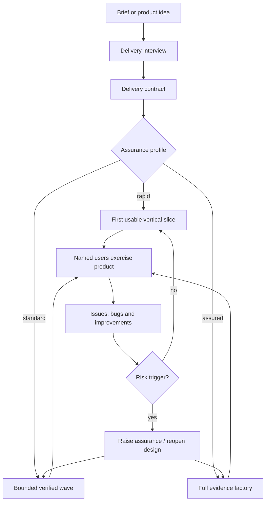

# Design: Risk-Calibrated Delivery

The Software Factory needs a deliberate fast path for controlled internal
products where time to first use matters more than eliminating every known
defect before release. The current evidence-first method remains appropriate
for public, regulated, irreversible, security-sensitive, or canonical systems,
but it must not be the only delivery shape.

This design adds an explicit delivery contract at requirements time and uses
it to calibrate architecture, planning, verification, review, promotion, and
iteration. It does not weaken the factory's invariant safety boundaries. It
changes when assurance is required and which defects may be fixed after a
reversible beta is in users' hands.

Adam approved the design on Bead `software-factory-aly`. The repo-only skill
and Factory Method changes are implemented under `software-factory-1ih`; the
separate Vita pilot remains pending on `software-factory-5sp`. The updated
[Factory Method](../factory-method.md) is authoritative for current factory
behaviour.

## Problem

The factory currently optimises for acceptance-criteria completeness and
reproducible evidence. It does not explicitly optimise for elapsed time to the
first useful user journey. Its `deliveryProfile` changes model routing, but the
architecture gate, worktree lifecycle, deterministic story review, full-suite
merge gate, finding drain, and union review remain substantially fixed.

That creates three failure modes for low-exposure internal products:

1. A broad product ambition becomes a production-complete requirements set
   before the operator has stated the acceptable risk or delivery horizon.
2. Plans can deliver foundations and backend subsystems before any user can
   exercise the product, even though the plan-builder discourages horizontal
   slices.
3. Correctness controls that found real defects become universal ceremony,
   rather than controls triggered by the consequence and reversibility of the
   code being changed.

The result can be fast code generation but slow value delivery.

## Vita Trial Evidence

The `vdb-uk/vita-platform` trial is the motivating case. This snapshot was
verified on 2026-07-21 at `main`/`origin/main` `b489d67`, immediately after E3-3
was claimed:

- 110 commits followed the setup-verification commit; 12 were `feat` commits,
  while 66 were `docs`, `chore`, or merge commits.
- Tracked review evidence contained 28 verdicts and 95 files. Review evidence
  added about 91,666 lines, versus about 35,188 product additions. Generated
  reviewer transcripts inflate the evidence count, but still consume agent,
  review, storage, and coordination time.
- `packages/api/src` contained about 21,025 lines; `packages/web/src` contained
  37. The user-facing dashboard was still a scaffold.
- The plan deliberately ordered foundation, core-domain API, and sweeps/source
  evidence before client surfaces.
- E2 wave 2 demonstrated a useful local optimisation: three backend stories
  became code-complete in under an hour using light implementer gates and
  selective independent review. Promotion nevertheless completed the next
  morning after union review and remediation.
- Reviews were not empty ceremony. They found genuine superuser, gate-bypass,
  transaction, concurrency, and database-integrity defects.

The lesson is not “stop testing” or “stop reviewing.” It is: match assurance to
the impact of a defect, and deliver a reversible vertical slice before hardening
the whole platform.

## Goals

- Ask the deployment, user, reversibility, and defect-tolerance questions before
  requirements expand into a production platform.
- Make time to the first usable journey a planned and measured outcome.
- Preserve strong controls wherever a defect could expose secrets, mutate an
  authority, lose irreplaceable data, make an external commitment, or cross an
  irreversible boundary.
- Allow known lower-severity defects to enter an issue-driven iteration loop
  without individual waiver theatre during a controlled beta.
- Keep the current assured factory path available and unchanged in intent.
- Add the smallest practical surface to the existing skills rather than create
  a second factory.

## Non-Goals

- Making `rapid` the default when risk is unknown.
- Treating “internal” as automatically safe: an internal system may still own
  canonical, financial, personal, contractual, or otherwise high-impact data.
- Relaxing credential, destructive-action, public-exposure, or human-approval
  boundaries.
- Removing tests, traceability, durable requirements, or all independent review.
- Replacing Beads as this repository's durable execution tracker.
- Changing active factory behaviour in this design-only session.

## Delivery Contract

The requirements interview MUST record one delivery contract before criteria
are confirmed. It asks no more than four load-bearing questions in its first
round:

1. Who will use this, and where can they reach it: named internal users,
   invited users, customers, or the public?
2. What data or system remains authoritative, and can the new product be reset,
   repaired manually, or rolled back?
3. Which failures are acceptable for now, and which would cause unacceptable
   security, financial, contractual, operational, or data consequences?
4. What is the target for the first usable journey, and what polish, edge cases,
   or operations work may follow through iteration?

The answers produce these separate fields:

| Field | Purpose | Example values |
|---|---|---|
| `operatingMode` | Human availability and action authority | `supervised`, `autonomous` |
| `modelRoutingProfile` | Agent/model cost and capability routing | `quality`, `balanced`, `throughput` |
| `assuranceProfile` | Required engineering and review ceremony | `rapid`, `standard`, `assured` |
| `releaseStage` | Current reversibility and authority state | `experiment`, `beta`, `operational`, `canonical` |
| `exposure` | Who can reach the product | `local`, `private`, `invited`, `public` |
| `dataCriticality` | Consequence of incorrect or lost state | `disposable`, `recoverable`, `canonical`, `regulated` |
| `firstUsableTarget` | Timebox and named user journey | duration plus observable journey |
| `acceptedDefects` | Defects that may enter iteration | explicit severity/categories |
| `releaseBlockers` | Failures that always stop this stage | explicit severity/categories |
| `escalationTriggers` | Events that require more assurance | cutover, exposure, credentials, irreversible writes |

`operatingMode`, model routing, and assurance are orthogonal. `supervised` must
not occupy a model-routing field, and `throughput` must not silently imply that
known defects may ship.

When the interview cannot establish the consequence of failure, the default is
`standard`, not `rapid`.

## Assurance Profiles

| | `rapid` | `standard` | `assured` |
|---|---|---|---|
| Intended use | Named users, private environment, reversible experiment/beta | Durable internal product with meaningful operational state | Public, regulated, high-impact, irreversible, or canonical system |
| Architecture | Concise decision note for expensive-to-reverse choices | Signed architecture for material choices | Full signed architecture, alternatives, evidence, and revisit triggers |
| First wave | One end-to-end usable journey | End-to-end slice plus supporting foundations | Risk-first stories mapped across the complete contract |
| Story verification | Focused tests, lint/type/build as applicable | Story gates plus affected/full integration gates | Full declared gates and evidence contract |
| Independent review | Triggered by risk; optional for routine reversible work | Required for high-risk stories and the integrated wave | Required per story and at promotion |
| Full suite | At the usable-slice boundary and before release | After merges or at the bounded wave gate | After every merge and promotion as currently defined |
| Known defects | P2/P3 may ship as linked issues | P2/P3 tracked; release decision follows the contract | Fixed or explicitly operator-waived before promotion |
| Durable evidence | Journey result, commands, issue links, release head | Story/wave evidence | Deterministic packets, verdicts, disclosures, full ledger |

Profiles are release-stage policies, not permanent labels. A repo may begin as
a rapid beta and move to standard or assured before its data becomes canonical.
It may not move down a profile merely to bypass a failing gate.

## Invariant Safety Boundaries

Every profile retains these stops:

- no credential or secret in source, prompts, arguments, logs, screenshots, or
  evidence;
- no public exposure, external publication, deployment, or service
  configuration without the operator's standing or current approval;
- no destructive or irreversible operation without explicit authority and a
  resolved target;
- no mutation or disablement of an existing authority during a reversible beta;
- no automatic human, commercial, legal, submission, or cutover decision where
  a human gate is required;
- no deleted tests, weakened assertions, falsified evidence, or claims beyond
  what was actually verified; and
- no `rapid` release when the new state is the only recoverable or canonical
  copy unless the operator explicitly raises the profile and satisfies the
  resulting gates.

These boundaries are consequence-based. They are not optional quality polish.

## Workflow

### Requirements

`hls-requirements-interview` adds the delivery contract and distinguishes:

- criteria required for the first usable slice;
- criteria required before operational use;
- criteria required before canonical cutover; and
- deliberately deferred improvements routed to issues.

A single confirmed requirement must not make beta and cutover criteria all
block the first delivery milestone.

### Architecture

`hls-architecture` keeps the rule that expensive-to-reverse decisions are made
explicitly. Under `rapid`, reversible implementation choices do not require a
full options study, PDF publication, or separate signature. A concise
architecture note records only:

- the system boundary and current authority;
- the first vertical slice;
- irreversible choices avoided;
- invariant safety boundaries; and
- triggers that require the full architecture phase.

Public exposure, credentials, destructive migration, canonical cutover, or a
third-party production integration always triggers fuller architecture work.

### Planning

`hls-plan-builder` makes `firstUsableTarget` a plan gate. A rapid first wave
MUST:

- name one journey a real operator can complete end to end;
- include the minimum UI/API/data wiring needed for that journey;
- stay within its declared active-time target;
- leave the prior authority unchanged and provide reset/rollback;
- carry focused executable verification; and
- identify every deferred criterion or defect destination.

Foundation-only or backend-only first waves are invalid unless no user-facing
journey exists or the operator explicitly approves the delay with a reason.

### Orchestration, Review, and Promotion

`hls-factory-orchestrate` chooses review depth from the assurance profile plus
story risk. Independent review is mandatory in every profile when a change
touches:

- authentication, authorisation, secrets, or exposure;
- destructive migrations, irreplaceable or canonical state;
- human/commercial gates or money-moving behaviour;
- real concurrency, idempotency, recovery, or cross-tenant isolation; or
- an explicit architecture/security boundary.

Routine reversible CRUD, copy, layout, and internal workflow changes may use
coordinator verification under `rapid`. Several small low-risk issues may be
batched into one iteration slice. The full suite and one real user/browser
journey run at the slice boundary.

The rapid promotion gate blocks P0/P1 findings and invariant-boundary failures.
P2/P3 findings may ship only when they are durably linked to issues, the release
remains reversible, and the operator can see the known-issues set without
reading review transcripts.

### Issue-Driven Iteration

GitHub Issues are the proposed human-facing feedback backlog for controlled
products such as Vita. They hold the observed problem, reproduction, user
impact, desired outcome, severity, and release milestone.

Beads remains the agent execution and dependency system. Do not mirror the
whole GitHub backlog into Beads. Create one linked Bead only when an issue or a
small issue batch is selected for multi-session factory work. The GitHub issue
closes when the user-visible outcome is verified; the Bead closes when the
bounded execution work and evidence are complete.

One future `hls-issue-iteration` skill is sufficient. It should perform:

`select -> reproduce -> classify risk -> implement -> proportionate verify -> user-journey check -> close or requeue`.

It must reuse the repo's delivery contract and orchestration rules, not create
a parallel process, tracker abstraction, or architecture phase for every bug.

## Decisions and Rejected Alternatives

### D1 — Assurance is separate from operating mode and model routing

**Decision:** record three orthogonal settings.

**Rejected:** expanding the current `deliveryProfile` values to include
`supervised`, `rapid`, and model tiers. That would combine human authority,
compute economics, and release risk in one ambiguous control.

### D2 — Rapid means reversible beta, not permanently lower quality

**Decision:** permit fix-forward iteration while an older authority remains
available and the beta can be reset or rolled back.

**Rejected:** using “internal” or “only two users” as a blanket reason to skip
data-integrity and recovery work after the system becomes canonical.

### D3 — Review is risk-triggered under rapid

**Decision:** keep independent review for high-consequence changes and allow
coordinator verification for routine reversible work.

**Rejected:** removing independent review entirely. Vita reviews found defects
that would matter even in a private system.

### D4 — First usable journey is a planning invariant

**Decision:** make a vertical user journey the rapid first-wave gate.

**Rejected:** relying on “vertical stories” guidance while permitting
foundation, complete domain API, and worker epics to precede all client
surfaces.

### D5 — Product issues and execution state have different owners

**Decision:** GitHub Issues face Hannah/Adam; linked Beads exist only for active
multi-session execution.

**Rejected:** mirroring two complete backlogs, which creates synchronisation
work and conflicting sources of truth.

## Vita Pilot

The pilot validates this design; it is not authorised by this document to
change `vita-platform`.

Proposed Vita delivery contract:

| Field | Pilot value |
|---|---|
| Users | Hannah, Adam, and their agents |
| Exposure | Private/tailnet only |
| Assurance | `rapid` |
| Release stage | `beta` |
| Authority | Existing Vita state remains authoritative and readable |
| New state | Resettable/rebuildable until a separate cutover |
| Accepted for beta | UI/API edge bugs, downtime, manual repair, incomplete polish |
| Blocks beta | secret leakage, public exposure, legacy mutation, loss of sole authoritative data, bypass of human commercial gates |
| First usable journey | Hannah opens the dashboard, reviews current opportunity/pipeline state, and records one permitted action through the API |
| Target | One working day of active agent time after the pilot replan |

Pilot sequence:

1. Checkpoint the currently active E3-3 work without discarding verified code.
2. Reclassify the 22 requirements into beta, operational, and canonical-cutover
   milestones.
3. Cut an immediate dashboard slice against the existing E2/E3 API. Use a
   functional accessible visual default; product-personality exploration is an
   issue, not a beta blocker.
4. Supply useful data through an approved read-only runtime snapshot/import
   path that copies no client/source material into git and leaves legacy
   unchanged.
5. Verify the named browser journey and reset/rollback path.
6. Deploy to the private tailnet only under explicit deployment authority, then
   let Hannah and Adam dogfood it.
7. Capture defects and improvements in GitHub Issues and deliver bounded issue
   batches under the rapid profile.
8. Raise assurance before the new database becomes canonical or legacy paths
   are disabled; complete the required sweep, reconciliation, backup/restore,
   and cutover controls at that boundary.

## Software Factory Implementation Sequence

1. Add the delivery contract to `hls-requirements-interview` and its template.
2. Add proportional architecture paths and escalation triggers to
   `hls-architecture`.
3. Add first-usable-wave, release-stage coverage, and deferral rules to
   `hls-plan-builder`.
4. Add assurance/risk-based verification, review, promotion, and issue routing
   to `hls-factory-orchestrate`.
5. Separate operating, routing, and assurance fields in `hls-process-init` and
   `.factory/agents.json` guidance.
6. Add the bounded `hls-issue-iteration` skill and self-contained references.
7. Update the Factory Method, README/index, per-skill changelog entries, and
   validator expectations in the same release.
8. Update Vita's installed skill lock, record its delivery contract, run the
   pilot, and feed observed generic defects back through the normal skill
   feedback/sweep path.

Steps 1–7 are implemented under Bead `software-factory-1ih`. Step 8 is the
separate, unclaimed Vita follow-up `software-factory-5sp`; this run did not edit
Vita. Beads, not this document, remains the task tracker.

## Acceptance Criteria for the Factory Change

1. A requirements interview cannot confirm a new product without recording the
   delivery contract or explicitly retaining the `standard` default.
2. Operating mode, model routing, assurance profile, and release stage are
   represented separately and validated.
3. A rapid plan cannot start with a foundation-only wave when a usable vertical
   journey can be delivered safely.
4. Rapid orchestration blocks invariant-boundary and P0/P1 findings but can
   route P2/P3 findings to visible issues without per-finding waiver ceremony.
5. Risk-triggered independent review remains mandatory across all profiles.
6. Escalation triggers prevent a rapid beta from becoming public, irreversible,
   or canonical without re-planning at the required assurance level.
7. Standard and assured projects retain at least the current verification and
   review protections unless an explicit later design changes them.
8. GitHub Issues and Beads have documented, non-duplicative ownership.
9. The Vita pilot produces its named usable dashboard journey within one
   working day of active agent time after re-planning, or the design is revised
   from the observed failure.
10. No pilot action mutates or disables the legacy Vita authority before an
    independently approved cutover.

## Measures

Every pilot or first release records:

- active agent time from confirmed delivery contract to first usable journey;
- elapsed time spent implementing, verifying, reviewing, and waiting;
- number and severity of known issues at release;
- escaped P0/P1 defects;
- reset, rollback, and manual-repair events;
- issue time-to-reproduction and time-to-verified-fix; and
- the release-stage and assurance transitions that occurred.

Artifact count and story count are diagnostic only. The primary rapid-profile
measure is elapsed active time to a safe, reversible user outcome.

## Approval and Revisit Triggers

Adam approved the design on 2026-07-21 via Bead `software-factory-aly`. The
implementation updates the Factory Method in the same session as the active
process changes and records every changed skill in `CHANGELOG.md`. Status
remains `implemented-pilot-pending` until AC 9–10 are exercised in the separate
Vita-scoped run.

Revisit this design when:

- a rapid pilot ships an escaped P0/P1 defect;
- first-use targets are repeatedly missed;
- issue tracking duplicates or loses work between GitHub and Beads;
- operators routinely override the selected assurance profile; or
- evidence shows the rapid path costs more remediation time than it saves.
