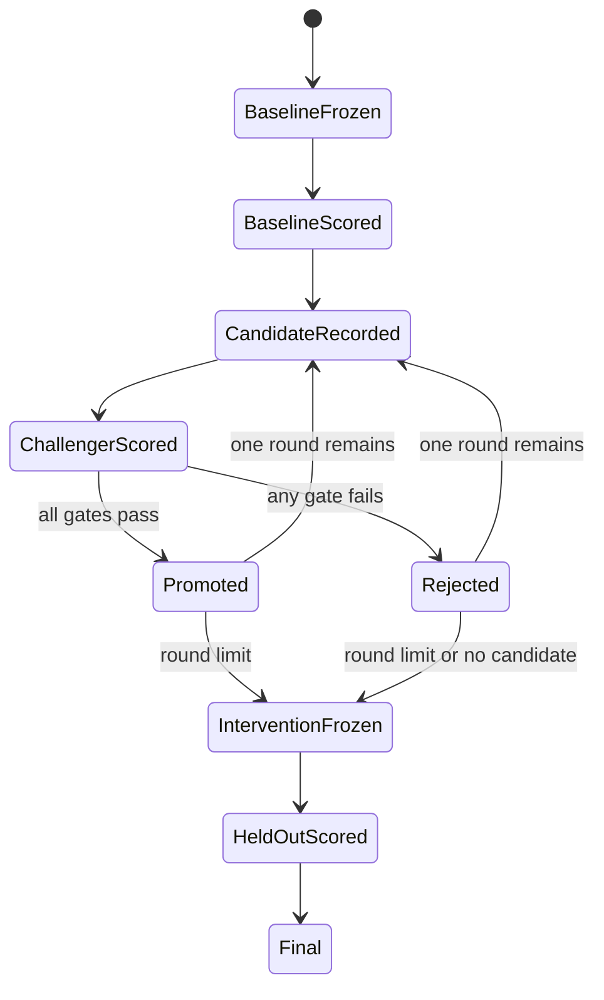

# Design: Structured Reporting Experiment Protocol

This design binds the corpus, task split, configuration matrix, scoring,
improvement gate, and reporting boundary for the synthetic laptop trial.

## Contract Surface

The protocol module MUST expose idempotent operations to:

- generate and validate all fictional report representations;
- expand portable family/model/effort declarations into exact preflight-proven
  configurations;
- build the baseline, challenger, held-out, and consistency cell manifests;
- freeze and verify a content-hashed protocol;
- score verified final responses without network access;
- evaluate challenger promotion gates; and
- aggregate verified scores into machine-readable report input.

## Corpus Invariants

- All entities and data MUST be visibly fictional and unaudited.
- Canonical typed sources MUST be the sole authored content source.
- XBRL/iXBRL, semantic HTML, and PDF MUST be generated, never edited apart.
- The locator manifest MUST map each scored fact/proposition to every format.
- Format validators and equivalence tests MUST pass before matrix freeze.
- No real filing, buyer material, or externally retrieved content may enter the
  canonical protocol.

## Matrix and Split

The complete matrix MUST contain exactly:

- two exact Claude models × two supported native effort levels; and
- two exact Codex models × two supported native effort levels.

Aliases MAY assist discovery but MUST NOT appear in the frozen manifest. A
fallback model, missing cell, or silently remapped effort invalidates complete
status.

Eight matched task specifications MUST be frozen: four development and four
held-out. Each task MUST have XBRL/iXBRL, HTML, and PDF cases, producing 12
cases per split. Gold answers for the held-out set MUST remain unavailable to
the coordinator until intervention freeze.

## Cell Identity

The stable cell ID MUST be a digest of:

`protocol version + round + split + task + report + representation + provider + exact model + native effort + repetition`.

Changing any component creates a new cell. A transport retry retains the cell
ID and adds attempt lineage; a second valid answer is a declared repetition.

## Scoring

Primary scoring MUST be deterministic and component-based. The answer schema
MUST distinguish answer values, units/periods/entities, propositions, evidence
locators, uncertainty, and refusal. Penalties MUST be declared before baseline.

The scorer MUST retain component-level evidence and MUST count malformed,
refused, timed-out, and failed cells in aggregate denominators. Re-scoring MUST
write a new derived record linked to the same receipt and scorer version.

## Improvement State Machine

An intervention MUST be shared across all eight configurations and limited to
one changed concern per round. Provider-specific tuning, scorer changes,
held-out inspection, and post-held-out iteration are prohibited.

Promotion MUST be mechanical using the thresholds in AC-12. A failed
challenger remains a first-class result; the coordinator cannot waive a gate.

## Reporting Boundary

Aggregates MUST identify exact harness/model/effort and round. Format strata MAY
be emitted as synthetic diagnostics with counts but MUST NOT be ranked or
described as a general format effect. Every headline result MUST carry the
synthetic non-generalisation notice from the requirements.

The generated report MUST link aggregates to the frozen manifest and receipts,
and the same `results/summary.json` values MUST populate Mermaid labels and
accessible tables.
