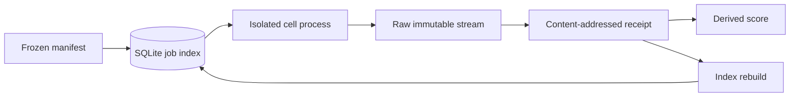
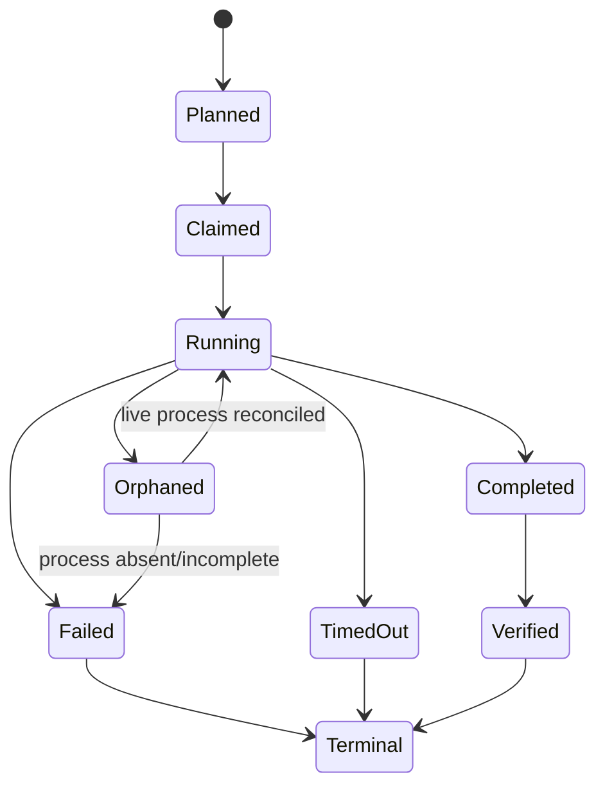

# Design: Structured Reporting Laptop Runner

This design defines the deterministic local runner, adapter contract, state,
process lifecycle, and evidence invariants used by either top-level coordinator.

## CLI Contract

`trialctl` MUST provide these stable operations:

- `preflight`, `plan --dry-run`, `freeze`;
- `run`, `resume`, `watch`;
- `score`, `propose`, `challenge`, `finalise`;
- `report`, `verify`, and `rebuild-index`.

Every mutating operation MUST be idempotent or refuse with the conflicting
state. Every command MUST support machine-readable JSON output so Claude Code
and Codex coordinators receive identical facts.

## Adapter Contract

Each adapter MUST implement:

1. executable/version probe;
2. redacted authentication-mode probe;
3. exact model and effort capability probe;
4. structured-output and tool-policy nonce test;
5. frozen command construction;
6. event-stream capture and final-response extraction;
7. usage/quota/error normalisation without hiding native fields; and
8. deterministic receipt construction.

The Claude adapter MUST use the absolute `claude` executable in non-interactive
mode with explicit model, effort, schema, permission/tool, persistence, and
fallback settings. The Codex adapter MUST use the absolute `codex exec`
executable in ephemeral, read-only mode with explicit model, reasoning effort,
output schema, JSONL events, tool policy, and fallback settings.

If a harness cannot prove the exact model or no-fallback behaviour, its
configuration MUST fail preflight rather than run approximately.

## Host Profile

Tracked files define portable adapter roles and desired matrix tiers. The
gitignored `.trial/host.local.toml` MUST contain only:

- absolute executable paths;
- allowed environment-variable names and profile labels;
- operator-selected exact model candidates after discovery;
- concurrency/cooling settings within protocol bounds; and
- redacted latest preflight metadata.

It MUST be owner-readable only. Secret values and global configuration content
MUST never be copied into it or into receipts.

## Local State and Evidence

SQLite MUST provide atomic local claims and status queries only. It MUST be
deletable and rebuildable from the frozen manifest, process metadata, and
verified receipts. Files are the source of truth.

Every receipt MUST include the fields declared by the requirements and hashes
of its raw stream, final response, task workspace manifest, and frozen command.
Writing a receipt MUST use a temporary file plus atomic rename. Existing valid
receipts MUST never be overwritten.

## Process Lifecycle

Each cell MUST run in a fresh temporary directory with read-only task inputs and
a separate output path. The runner MUST start the harness in a new OS process
session, record PID/process-group identity, and redirect stdout/stderr directly
to append-only files. It MUST NOT rely on coordinator background-task features.

Resume MUST reconcile in this order: verified receipt, live process identity,
raw terminal stream, timeout, then eligible restart. A restart MUST retain
attempt lineage. The scheduler MUST never launch a second live attempt for a
claimed cell.

## Security and Tool Policy

- Inputs MUST be fictional and non-executable.
- Cells MUST have no external search or browsing capability.
- Each harness MUST receive an equivalent read/search-only policy plus the same
  bundled report-inspection command.
- Environment variables MUST be allowlisted per adapter; captured commands and
  logs MUST redact values.
- A cell MUST not be able to read gold answers, other cell directories, scores,
  receipts, or coordinator analysis.
- Concurrency MUST default to two overall and one per provider profile.
- Rate limits and cooling MUST pause dispatch; they MUST NOT change model,
  effort, auth/billing, prompt, or result status.

## Verification

Offline tests MUST cover command construction, event parsing, redaction,
process kill/resume, orphan reconciliation, atomic receipt writes, duplicate
prevention, index rebuild, timeout/retry lineage, and tamper detection using
recorded synthetic harness streams. Live tests MUST be limited to explicit
preflight nonces until the operator approves the frozen full run.
