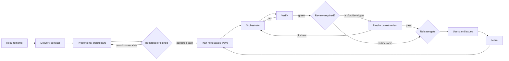

# The Factory Method

Higher Level Software's factory is an evidence loop for one human operator
using coding agents across one or more machines. It optimises neither agent
activity nor story count. Progress means acceptance criteria backed by
reproducible evidence.

Two rules shape everything:

> Never trust a completion claim; verify it.

> State that exists only in a conversation is already lost.

## The loop

## Delivery contract and assurance profiles

Requirements record four separate controls before scope expands:

| Field | Controls | Values |
|---|---|---|
| `operatingMode` | human availability and interaction cadence | `supervised`, `autonomous` |
| `modelRoutingProfile` | model tier and effort selection | `quality`, `balanced`, `throughput` |
| `assuranceProfile` | architecture, verification, review, and evidence depth | `rapid`, `standard`, `assured` |
| `releaseStage` | current reversibility and promotion boundary | `experiment`, `beta`, `operational`, `canonical` |

They are orthogonal: autonomy does not lower assurance, and throughput routing
does not authorize known defects or promotion. The contract also records
exposure, data criticality, the first usable journey, accepted defects,
release blockers, recovery, and escalation triggers. Unknown consequence
defaults to `standard`, never `rapid`.

| | `rapid` | `standard` | `assured` |
|---|---|---|---|
| Intended boundary | named private users; reversible experiment/beta | durable internal product | public, regulated, high-impact, irreversible, or canonical |
| First wave | one end-to-end usable journey | bounded verified vertical wave | risk-first complete-contract coverage |
| Review | consequence-triggered | existing per-story and integrated protections | existing protections plus expanded failure/security evidence |
| Full suite | usable-slice and release boundary | existing merge/wave gates | every merge and promotion |
| Known defects | contract-accepted P2/P3 as visible linked issues | tracked under the release contract | fixed or operator-waived before promotion |

Profiles may rise as exposure or authority changes. They may not be lowered to
bypass a red gate. Every profile stops for secrets, destructive/irreversible
or canonical mutation, unapproved public/deploy/external actions, required
human/commercial decisions, test weakening, or false evidence.

### Requirements

A structured interview turns intent into a confirmed document with numbered,
testable acceptance criteria. Those criteria are the progress ledger; no later
summary may weaken them. Confirmation also requires the delivery contract or
an explicit `standard` default. Criteria state whether they are required for
first use, operational use, canonical cutover, or a linked deferred issue.

### Architecture

Before planning, expensive-to-reverse choices are made explicit and assessed
against project constraints. There is no silent house stack. Requirements,
existing systems, operator/host reality, security, cost, reversibility, and
local verification determine the recommendation.

Rapid work may use a concise `recorded` note for a private reversible beta:
boundary, chosen shape, first vertical slice, recovery, risks, and escalation
triggers. Standard and assured retain signed architecture, options, diagrams,
revisit triggers, and epic design-doc anchors; an agent cannot approve its own
proposal. Authentication/secrets, public exposure, destructive/canonical
state, money/human gates, concurrency/recovery/cross-tenant behaviour, or an
architecture/security boundary restore the signed path.

Third-party integrations use one production adapter across deterministic
simulators, real non-production observation, staging where applicable, and
production. Each new redacted real behaviour updates a versioned simulator
fixture and regression test. Neither simulator nor real-vendor evidence may
pretend to be the other.

### Plan

The plan maps every criterion and design-doc MUST to a story. Stories are cut
just in time against the current integration branch, sized for one agent and
one worktree, and carry scope, evidence inputs, resources, complexity, exact
verification, and must-not-regress constraints. Epics anchor design; Beads
computes their delivery state.

Complexity routes models; consequence risk routes review. A rapid first wave
must complete the named end-to-end operator journey with minimum UI/API/data
wiring, preserve the prior authority, and carry reset/rollback. A foundation-
only wave is invalid when a safe usable journey exists unless the operator
records why it must wait. The criteria ledger retains later milestones and
visible issue links so speed does not erase scope.

### Orchestrate and verify

The coordinator keeps the queue moving and does not write product code. Each
implementer receives one story in a coordinator-created worktree. The
coordinator then re-runs the promised tests, lint/build, affected checks, and
UI evidence. A red gate bounces with exact output before review consumes time.

Standard and assured keep the existing story and post-merge gates. A routine
rapid story may use focused and affected checks, but the full configured suite
and one real user/browser journey run at the first-usable slice and release
boundaries. Invariant failures and P0/P1 findings block every profile.

Resource leases, host capacity, provider availability, and preflight bound
parallelism. A second concurrent merge rebases and re-runs gates against the
combined tree.

### Review

Independence means a fresh, read-only agent context that never receives the
implementer conversation. It does not mean a second human, provider, account,
model, or host.

Standard and assured retain independent review for every story and the
integrated result. Rapid may use coordinator verification for routine,
reversible CRUD, copy, layout, or internal workflow changes. Independent
review remains mandatory in every profile for authentication/authorisation,
secrets/exposure, destructive or canonical state, money or human/commercial
gates, concurrency/idempotency/recovery/cross-tenant behaviour, and explicit
architecture/security boundaries.

Before a story branch diverges, the plan-owned review inputs are frozen in a
base-committed contract. The packet builder combines exact Git blobs, the
literal canonical diff, and a versioned template. The verdict binds base/head,
contract, inputs, template, diff, manifest, and prompt hashes. CI rebuilds the
packet; a new commit or changed range invalidates PASS.

Round one reviews the whole story. At most two delta rounds receive only the
verified prior blockers and changed range. Blockers must be fixed; non-blockers
become tracked findings rather than disappearing in prose.

Template versions are low-frequency rule changes. The operator reviews and
records them as dedicated repository changes; an agent may propose but never
approve its own template.

### Promotion and learning

Under standard and assured, non-blockers may pass a story but may not ride
through final promotion unresolved. Findings are fixed through the normal loop
or explicitly waived by the operator and disclosed. The combined integration
diff receives its own review because per-story reviews cannot see cross-story
interactions.

A rapid private release instead blocks P0/P1 and invariant failures, runs the
full suite and named journey, proves reset/repair and preserved prior
authority, and links every contract-accepted P2/P3 in a visible known-issues
set. It needs integrated independent review when any combined risk trigger
applies; otherwise the coordinator records the integrated risk check and exact
released head. Rapid must re-plan at raised assurance before public,
irreversible, operational-without-recovery, or canonical use.

Every session records what changed, why, and the evidence. Stack-specific
lessons grow the playbook; generic factory defects travel through feedback,
sweep, release, and consumer update. A released fix is not learned by a
consumer until its committed skills lock is updated and any local stopgap is
reconciled.

### Issue-driven iteration

GitHub Issues own human-facing feedback for GitHub-hosted products: observed
problem, reproduction, impact, desired outcome, severity, and release
milestone. Beads owns selected multi-session execution and dependencies. The
factory does not mirror the whole issue backlog into Beads.

The iteration loop is: select → reproduce → classify consequence risk → bound
the change → implement → proportionate verification → affected user-journey
check → close or requeue. A small same-surface, same-risk batch is allowed; an
architecture or promotion trigger returns through the main factory loop. The
human-facing issue closes only when its outcome is verified on the intended
release head; its linked Bead closes when bounded execution evidence is done.

## One operator, several hosts

The human control plane is deliberately singular:

- the operator confirms requirements and architecture;
- the operator owns waivers, promotion, deploys, credentials, and external
  actions;
- agents coordinate, implement, verify, review, observe, and record evidence;
- laptops and VPSs provide execution capacity and failover only.

Every host has a gitignored local capability profile. All hosts share one
Beads queue, while one active coordinator lease prevents split-brain claims
and merges. Failover reconstructs work from Beads, branches, PRs, logs, and
plans—not copied conversations or untracked directories.

The fixed-shape status report answers: which coordinator lease is active,
which hosts and lanes are healthy or silent, what moved, what is blocked, what
landed, and what requires the operator. Status observes and never changes
delivery state.

## Roles are agent contexts

| Context | Does | Never does |
|---|---|---|
| Coordinator | claims, dispatches, verifies, integrates, records | implements stories or approves operator decisions |
| Implementer | completes one bounded story in one worktree | manages the queue, expands scope, reviews its own work |
| Reviewer | judges the deterministic packet and emits a pinned verdict | edits code or receives implementer context |
| Status observer | reads live sources into a fixed report | mutates tracker, PR, branch, lane, or gate state |
| Operator | signs, waives, promotes, authorises external actions | re-explains state that should be durable |

The same human and machine may launch every context. Session boundaries,
permissions, deterministic inputs, and evidence enforce separation.

## Self-documenting consumers

A consumer README should reach the signed architecture, decision reasons,
active plan/criteria coverage, and process in one or two clicks. Markdown is
the source of truth. Documents that genuinely leave the repo may be rendered
as published PDFs, with the regeneration command recorded and stale artifacts
removed or rebuilt.

## Completion

A factory run reaches its current release boundary only when every criterion
required for that milestone maps to closed work with evidence; later criteria
remain explicitly linked. Standard/assured findings are fixed or operator-
waived and review PASS matches the promoted head. Eligible rapid P2/P3 defects
are visible linked issues, all P0/P1 and invariant failures are closed, the
full suite and named journey are green at the slice/release head, and recovery
is still real. In every profile, the log and Beads state let a fresh session
resume without this conversation.
