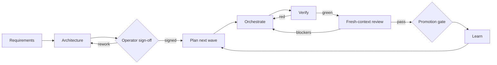

# The Factory Method

Higher Level Software's factory is an evidence loop for one human operator
using coding agents across one or more machines. It optimises neither agent
activity nor story count. Progress means acceptance criteria backed by
reproducible evidence.

Two rules shape everything:

> Never trust a completion claim; verify it.

> State that exists only in a conversation is already lost.

## The loop

### Requirements

A structured interview turns intent into a confirmed document with numbered,
testable acceptance criteria. Those criteria are the progress ledger; no later
summary may weaken them.

### Architecture

Before planning, expensive-to-reverse choices are researched as real options
and assessed against explicit project constraints. There is no silent house
stack. Requirements, existing systems, operator/host reality, security, cost,
reversibility, and local verification determine the recommendation.

The architecture records diagrams, decisions and reasons, revisit triggers,
and epic design-doc anchors. The operator signs it; an agent cannot approve
its own proposal.

Third-party integrations use one production adapter across deterministic
simulators, real non-production observation, staging where applicable, and
production. Each new redacted real behaviour updates a versioned simulator
fixture and regression test. Neither simulator nor real-vendor evidence may
pretend to be the other.

### Plan

The plan maps every criterion and design-doc MUST to a story. Stories are cut
just in time against the current integration branch, sized for one agent and
one worktree, and carry scope, evidence inputs, resources, complexity, exact
verification, and must-not-regress constraints. Epics anchor design; Beads
computes their delivery state.

### Orchestrate and verify

The coordinator keeps the queue moving and does not write product code. Each
implementer receives one story in a coordinator-created worktree. The
coordinator then re-runs the promised tests, lint/build, affected checks, and
UI evidence. A red gate bounces with exact output before review consumes time.

Resource leases, host capacity, provider availability, and preflight bound
parallelism. A second concurrent merge rebases and re-runs gates against the
combined tree.

### Review

Independence means a fresh, read-only agent context that never receives the
implementer conversation. It does not mean a second human, provider, account,
model, or host.

Before a story branch diverges, the plan-owned review inputs are frozen in a
base-committed contract. The packet builder combines exact Git blobs, the
literal canonical diff, and a versioned template. The verdict binds base/head,
contract, inputs, template, diff, manifest, and prompt hashes. CI rebuilds the
packet; a new commit or changed range invalidates PASS.

Round one reviews the whole story. At most two delta rounds receive only the
verified prior blockers and changed range. Blockers must be fixed; non-blockers
become tracked findings rather than disappearing in prose.

Template versions are low-frequency rule changes. The operator reviews and
records them as dedicated repository changes; an agent may propose but never
approve its own template.

### Promotion and learning

Non-blockers may pass a story but may not ride through final promotion
unresolved. Findings are fixed through the normal loop or explicitly waived
by the operator and disclosed. The combined integration diff receives its own
review because per-story reviews cannot see cross-story interactions.

Every session records what changed, why, and the evidence. Stack-specific
lessons grow the playbook; generic factory defects travel through feedback,
sweep, release, and consumer update. A released fix is not learned by a
consumer until its committed skills lock is updated and any local stopgap is
reconciled.

## One operator, several hosts

The human control plane is deliberately singular:

- the operator confirms requirements and architecture;
- the operator owns waivers, promotion, deploys, credentials, and external
  actions;
- agents coordinate, implement, verify, review, observe, and record evidence;
- laptops and VPSs provide execution capacity and failover only.

Every host has a gitignored local capability profile. All hosts share one
Beads queue, while one active coordinator lease prevents split-brain claims
and merges. Failover reconstructs work from Beads, branches, PRs, logs, and
plans—not copied conversations or untracked directories.

The fixed-shape status report answers: which coordinator lease is active,
which hosts and lanes are healthy or silent, what moved, what is blocked, what
landed, and what requires the operator. Status observes and never changes
delivery state.

## Roles are agent contexts

| Context | Does | Never does |
|---|---|---|
| Coordinator | claims, dispatches, verifies, integrates, records | implements stories or approves operator decisions |
| Implementer | completes one bounded story in one worktree | manages the queue, expands scope, reviews its own work |
| Reviewer | judges the deterministic packet and emits a pinned verdict | edits code or receives implementer context |
| Status observer | reads live sources into a fixed report | mutates tracker, PR, branch, lane, or gate state |
| Operator | signs, waives, promotes, authorises external actions | re-explains state that should be durable |

The same human and machine may launch every context. Session boundaries,
permissions, deterministic inputs, and evidence enforce separation.

## Self-documenting consumers

A consumer README should reach the signed architecture, decision reasons,
active plan/criteria coverage, and process in one or two clicks. Markdown is
the source of truth. Documents that genuinely leave the repo may be rendered
as published PDFs, with the regeneration command recorded and stale artifacts
removed or rebuilt.

## Completion

A factory run is done only when every acceptance criterion maps to closed work
with evidence, all findings are fixed or explicitly waived, review PASS matches
the exact promoted head, the full integration suite is green, and the log and
Beads state let a fresh session resume without this conversation.
