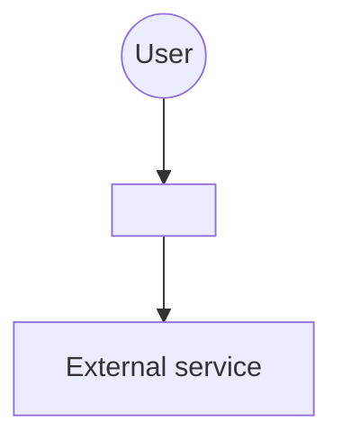
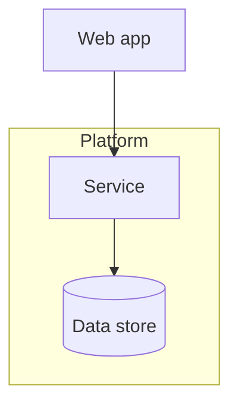

# Architecture Doc Template

Write to `docs/architecture/<slug>-architecture.md`. Keep it under ~600
lines — an architecture doc nobody reads protects nothing. Every Mermaid
diagram goes in a fenced ` ```mermaid ` block so GitHub renders it inline.

````markdown
---
id: ARCH-<slug>
requirements: docs/requirements/<slug>.md
status: draft            # draft | signed-off
signed_off_by:           # name, set at sign-off
signed_off_date:         # YYYY-MM-DD, set at sign-off
updated: YYYY-MM-DD
---

# Architecture: <Title>

One paragraph: what this system is and the shape we chose for it.

## Context & Constraints

The requirements and realities that bound every choice below: scale
expectations, operator/host constraints, budget posture, compliance, existing systems. Short —
link the requirements doc rather than restating it.

## System Overview

C4-style context diagram: the system, its users, the external systems it
talks to.



## Containers & Responsibilities

Container diagram (deployable units + datastores), then one table row per
container: name, responsibility, technology (linking to its options table).



| Container | Responsibility | Tech (see options) |
|---|---|---|
| Backend API | ... | ... (§T1) |

## Critical Flows

Sequence diagrams for the 2–4 flows where the design earns its keep —
money movement, auth, the core domain transaction. Not every flow.

## Tech Choices

One subsection per significant choice. This is the heart of the doc.

### T1: <choice, e.g. Backend runtime>

| Option | Pros | Cons |
|---|---|---|
| <candidate A> | ... | ... |
| <candidate B> | ... | ... |

**Chosen:** <option> — one paragraph of *why*, in terms of the
requirements and the recorded decision criteria. Name the evidence and any
uncertainty rather than relying on an unstated default.
**Revisit when:** <the trigger that reopens this>.

## Data

Persistence posture: chosen store(s), migration/evolution strategy, ownership,
backup/recovery, and how specialized needs such as search, documents, or jobs
are handled. Link the relevant options table.

## Deployment & Scaling Posture

How it runs locally, how it deploys, and any recorded-but-unbuilt scaling or
resilience path. State the seams and quantified triggers that would activate
that path without prescribing a platform in advance.

## Epics

The decomposition planning will consume. One row per epic; design docs are
written for the first wave now, just-in-time for the rest.

| Epic | One-line responsibility | Design doc |
|---|---|---|
| <epic> | ... | docs/design/<epic>.md |

## Risks

| Risk | Mitigation / early-warning signal |
|---|---|

## Revisit Triggers

The consolidated list of what would reopen which decision — the doc's
alarm wiring.
````

## Design docs (`docs/design/<epic>.md`)

The epic-scale companion: contract surface (endpoints/operations), data
model, security posture, invariants, and constraints — written as binding
requirements (MUSTs), because story acceptance criteria are traced from
them. Include Mermaid where a diagram beats prose (ER diagrams, state
machines). A design doc is the anchor stories are cut from just-in-time;
if a MUST lives only here and no story AC carries it, the planning phase
has a fidelity bug.
