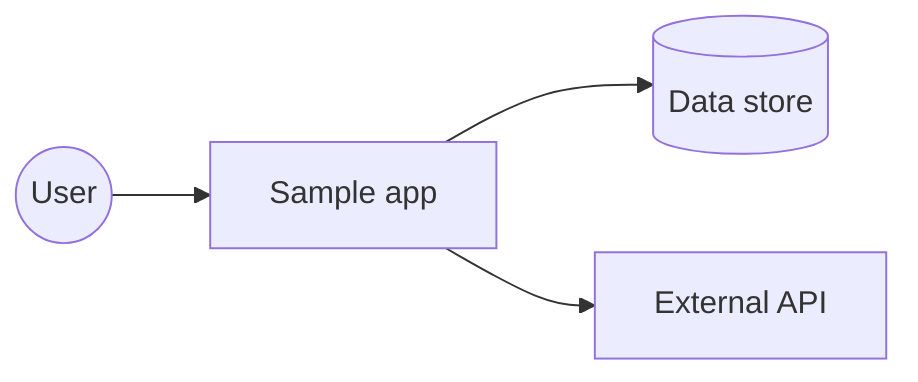
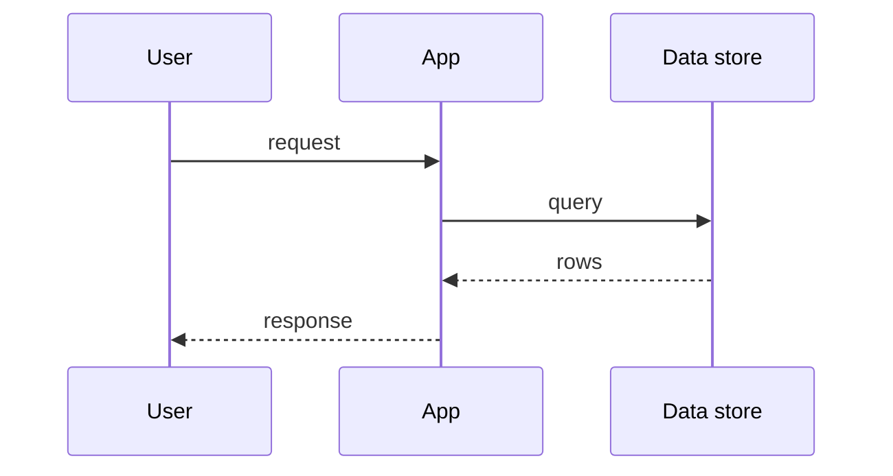

# Sample Report

Smoke-test input for the publish toolchain (mermaid-cli + md-to-pdf). Run
the skill's publishing commands against this file; a correct setup produces
a small PDF whose diagram below is rendered as an image, not left as a code
block. Do not commit the output.

## A system, minimally

## And a flow

If both diagrams appear as images in the PDF, the toolchain works.
